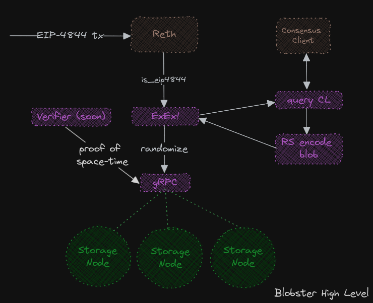

# blobster

[![Telegram Chat][tg-badge]][tg-url]

**[Docs](https://alignnetwork.github.io/blobster/quick-start.html)**

[tg-badge]: https://img.shields.io/endpoint?color=neon&logo=telegram&label=chat&url=https%3A%2F%2Ftg.sumanjay.workers.dev%2Falign%5Fblobster

Intro tweet thread: [Tweet](https://x.com/0xglu/status/1814354544505098331)

Blobster is a blazing fast and cheap long term **Ethereum Blob storage solution.**

Currently, the system can be used locally with the Reth development settings and comes with a Consensus Layer client to send simulated blobs to the node. We will move to using Holesky once the node is done syncing (soon!).

### Why?

The motivation behind creating a network to offer longer term storage solutions to blob storage is to build support and tooling to support the underexplored world of blobs and to test out Danksharding techniques in a real world setting. We think by taking advantage of the KZG commitment nature of blobs, we can streamline a SNARK proving system for storage nodes. Also taking advantage of erasure encoding and some mixing techniques, we believe we can achieve lower storage requirements than replication while still maintaining significant economic security. These ideas are a WIP and may change or be proven incorrect, however we think we have enough of a base to field outside opinions.

### How?

We run an [Reth Node w/ an ExEx](https://github.com/paradigmxyz/reth) that detects blobs, queries the consensus layer, erasure encodes the blobs and stores them in a series of storage nodes erasure encoding for cheap and efficient long term storage of blobs.

Curious about blobs? Check this guide by [Ethereum](https://ethereum.org/en/roadmap/danksharding/) and the [EIP-4844](https://www.eip4844.com/) website.

## Quick Start

https://github.com/user-attachments/assets/5b38256c-f9e7-4840-b228-190492ea680b

**[Docs](https://alignnetwork.github.io/blobster/quick-start.html)**

1. Clone the Repo

`git clone https://github.com/align_network/blobster`

2. Run Reth and the ExEx

`cargo run --bin exex --release -- node --dev`

3. Run the Mock Consensus Layer

Ensure you have libsql installed
`sudo apt-get install libsqlite3-dev`

`cargo run --bin mock-cl --release`

4. Send 10 Random data blobs

`cargo run --bin update_blocks --release`

## Storage Nodes

Storage Nodes are currently setup to have a max of 3

1. Run a Storage node

`cargo run --release --bin storage-node -- --node-id=1 --storage-dir=storage/node1`

### Roadmap

Currently the system can be run locally, and we are working to supporting bringing the system live on Holesky after we complete the following steps.

High level goals:

- [x] MVP local
- [ ] Finish syncing holesky (WIP)
- [ ] Implement Retrieval of blobs [#3](../../issues/3)
- [ ] Create a SNARK proving system for storage nodes to prove they are storing data & accompanying Merkle Proof state root tracking [#4](../../issues/4)
- [ ] Host network to open up storage node solutions [#5](../../issues/5)
- [ ] Implement a Storage Node Register [#6](../../issues/6)

[tg-badge]: https://img.shields.io/endpoint?color=neon&logo=telegram&label=chat&url=https%3A%2F%2Ftg.sumanjay.workers.dev%2Falign%5Fblobster
[tg-url]: https://t.me/align_blobster
